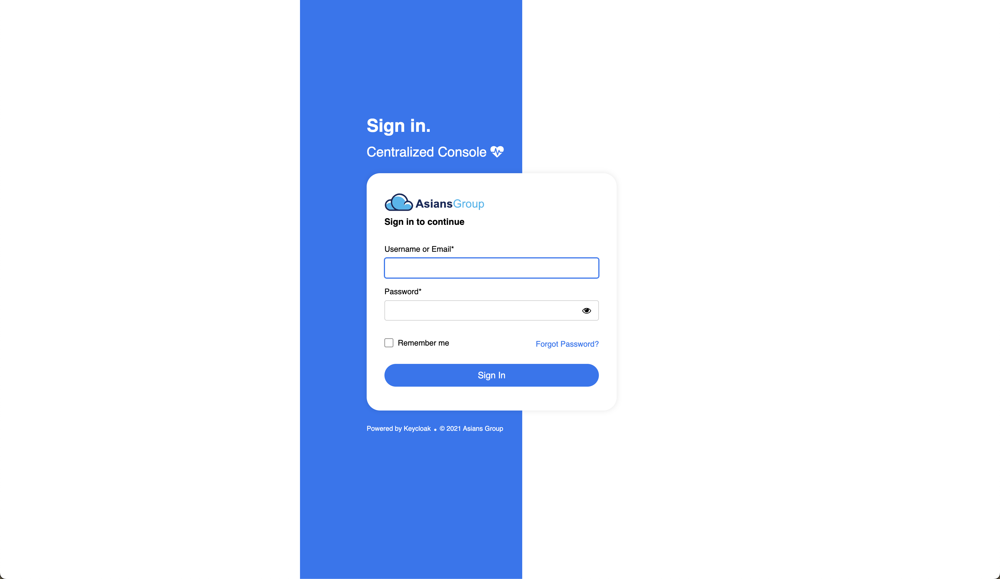

# KeyCloak Theme Customization

## Usage
```bash
docker-compose up -d
```

This will start a KeyCloak server at `http://localhost:8080`.

## Customization
The theme is located in `./theme` directory. You can customize the theme by modifying the files in this directory.

## Themes

### 1. `my-custom-theme`

Exploration of KeyCloak theme customization.

#### Previews



### 2. New Console Theme

Aligned with the new console UI/UX design.

#### Notes:
1. Social login should be enabled in the realm settings.
2. Realm HTML display name should be set to `<span class="branding"></span>`.
3. `Login screen customization` settings should have `User Registration`, `Forget Password`, and `Remember me` enabled.
4. `Email Settings` should have `Login with email` enabled.
5. Localization should be enabled for the realm. Supported languages so far are English, Japanese, and Chinese (Simplified).

#### Previews

")
   ")
   ")
   ")
   ")


## References
- [KeyCloak Documentation](https://www.keycloak.org/docs/latest/server_development/#_themes)
- [KeyCloak Login FTL](https://github.com/keycloak/keycloak/blob/main/themes/src/main/resources/theme/base/login/login.ftl)
- [KeyCloak Login Template](https://github.com/keycloak/keycloak/blob/main/themes/src/main/resources/theme/base/login/template.ftl)

